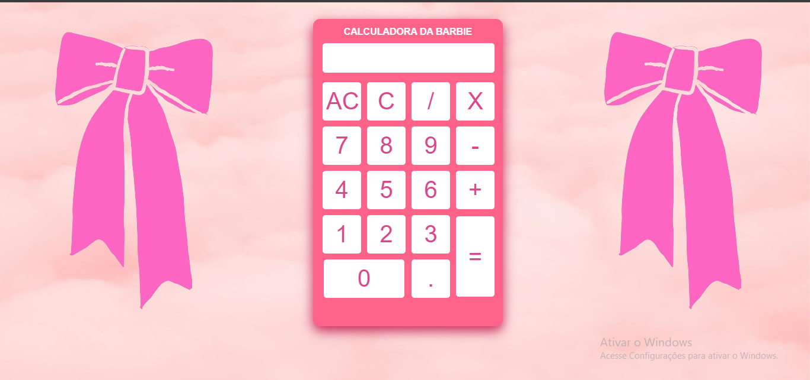

# **Sobre a Calculadora**

A calculadora possui as quatro operações básicas, foi construída baseada em um vídeo do youtube, do canal "Gustavo Neitzke". Segue o link:
[Assista ao vídeo](https://youtu.be/42TShjXR0m0?si=4Y3anRwFY8l-ekB-)

## Tecnologias usadas para construção da calculadora

## Ferramentas usadas para construção da calculadora 

# **Resultado da Calculadora**

  

